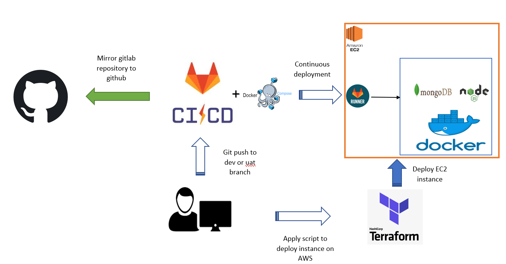
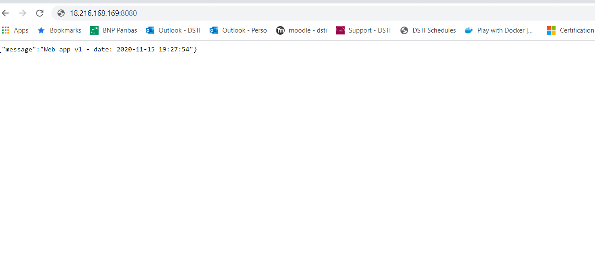
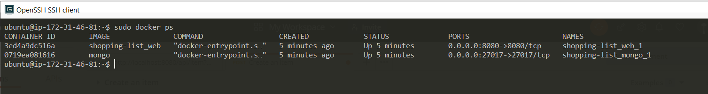
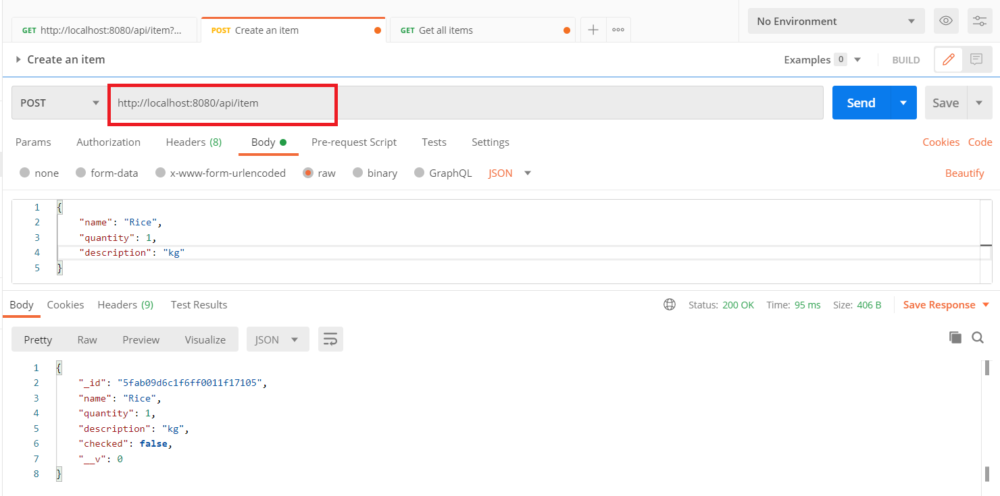
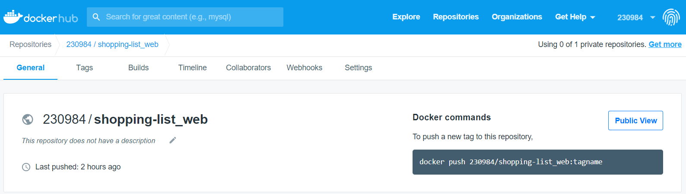

# Shopping list web app

[](https://gitlab.com/bngom/shopping-list)

Shopping list CRUD Application.

We will build a Shopping list CRUD Application.The back-end server uses Node.js + Express for REST APIs. MongoDB is used for the persistence layer.

## List of all the work performed (briefly, describing features and bonus tasks).

- Develop CRUD app: create, update, retrieve, delete an item
- CI/CD pipeline using: github, gitlab, gitlab runner, terraform, aws ec2 instance
- Iac using Ansible, Vagrant and Gitlab
- Kubernetes cluster ...
- Istio ...


## Instruction

- MongoDB

[Download](https://www.mongodb.com/try/download/community) and install MongoDB Community Server

- Webapp

clone the repository

```
git clone https://github.com/bngom/shopping-list.git
```

From the root directory of the project run:

```
npm install
```

Lauch tha application

```
npm start
```

- Usage

Create an item in the shopping list

```
curl --location --request POST 'http://localhost:8080/api/item' \
--header 'Content-Type: application/json' \
--data-raw '{
    "name": "Pasta",
    "quantity": 2,
    "description": "Panzani"
}'
```

Get all created items

```
curl --location --request GET 'http://localhost:8080/api/item'
```

Get item by id

```
curl --location --request GET 'http://localhost:8080/api/item/<ID>'
```

Update an item

```
curl --location --request PUT 'http://localhost:8080/api/item/<ID>' \
--header 'Content-Type: application/json' \
--data-raw '{
    "name": "Pasta",
    "quantity": 3,
    "description": "Adja****"
}'
```

Delete one item

```
curl --location --request DELETE 'http://localhost:8080/api/item/<ID>'
```

Delete all items

```
curl --location --request DELETE 'http://localhost:8080/api/item/'
```

- Testing

```
npm test
```

## CI/CD pipeline

Github -> GitLab <- AWS EC2 Instance (Gitlab Runner)<- Terraform




- Prerequisites

[Install Terraform](https://learn.hashicorp.com/tutorials/terraform/install-cli#install-terraform)

- ci/cd workflow and docker-compose

* Review the pipeline configuration file [.gitlab-ci.yml](./.gitlab-ci.yml). In this file we defined the different stages:
    
**test**: when develop branch is pushed it trigger the unittest execution.

**deploy**: when uat branch is pushed it trigger the deployment of the app stack to the ec2 instance where the runner is installed.

* Review the file [docker-compose.yml](./docker-compose.yml)

- Deploy an EC2 instance (T2.micro free tier)

Move to the folder `iac`. The instance will be deployed on **us-esat-2** region. Feel free to change the region in the file [gitlab-runner-instance.tf](./iac/gitlab-runner-instance.tf). 

In case you change the region make sure to change the ami (**ami-07efac79022b86107**). It differ to one region to another.

We deploy the instance using an existing aws key-pair named `ec2-p2`, generate your own on aws (**Service > EC2 > Key pairs > Create Key pair**) and update the [gitlab-runner-instance.tf](./iac/gitlab-runner-instance.tf) file.

> To do: generate the key pairs with terraform and extract the private key


Initialize

```
terraform init
```

Check the deployment plan

```
terraform plan
```

Provision an EC2 instance

```
terraform apply
```

Check on AWS is the instance is correctely provisionned

- Install gitlab-runner on the EC2 instance

Connect to the EC2 instance

```
ssh -i "ec2-p2.pem" ubuntu@ec2-3-23-63-91.us-east-2.compute.amazonaws.com
```

Complete the gitlab-runner installtion

```
sudo gitlab-runner register
```

Follow these [instructions](https://docs.gitlab.com/ee/ci/runners/README.html#specific-runners) to register the runner

Add `gitlab-runner ALL=(ALL) NOPASSWD: ALL` at the end of the sudoers file

```
sudo nano /etc/sudoers
```

> todo: make the gitlab-runner registration automatic in: [gitlab-runner-instance.tf](./iac/gitlab-runner-instance.tf)

```
git branch develop
git branch uat
```

Trigger the deployment on the ec2 instance
```
git checkout uat
git push
```


Connect throught ssh on the ec2 instance and check the running containers



Test the api



## Provision the VM with Ansible and Vagrant

...

## Build Docker image

Review the [Dockerfile](./Dockerfile)

Build the docker image

```
docker build -t shopping-list_web .
```

Push docker image to docker registry

```
docker tag shopping-list_web 230984/shopping-list_web
docker push 230984/shopping-list_web
```


## Docker compose

Review the [docker-compose.yml](./docker-compose.yml) file

```
docker-compose up
```

Open a browser on [http://localhost:8080](http://localhost:8080) to see the application

```
docker ps
```

- **shopping-list_web**: which represents our application
- **mongo**: which represents the persistence layer docker

## Docker orchestration using Kubernetes

...

## Service mesh using Istio

...

## Author

Barthelemy NGOM

barthe.ngom@gmail.com
