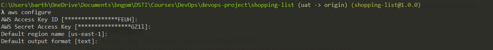
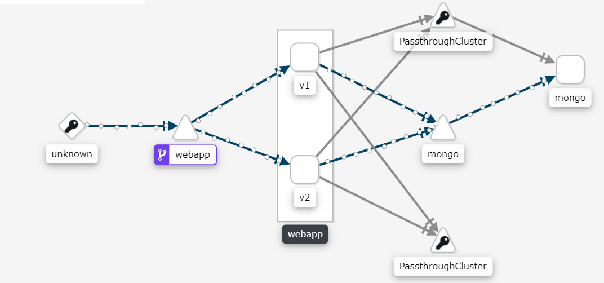

# Shopping list web app

[](https://gitlab.com/bngom/shopping-list)

Shopping list CRUD Application.

We will build a Shopping list CRUD Application.The back-end server uses Node.js + Express for REST APIs. MongoDB is used for the persistence layer.

### List of all the work performed (briefly, describing features and bonus tasks).

- Develop CRUD app: create, update, retrieve, delete an item
- CI/CD pipeline using: github, gitlab, gitlab runner, terraform, aws ec2 instance
- Iac using Ansible, Vagrant and Gitlab [work in progress...]
- Kubernetes cluster
- Istio [to do]


## Instruction

[Download](https://www.mongodb.com/try/download/community) and install MongoDB Community Server.

Clone the repository

```
git clone git@gitlab.com:bngom/shopping-list.git
```

From the root directory of the project run:

```
npm install
```

Lauch tha application

```
npm start
```

- Usage

Create an item in the shopping list

```
curl --location --request POST 'http://localhost:8080/api/item' \
--header 'Content-Type: application/json' \
--data-raw '{
    "name": "Pasta",
    "quantity": 2,
    "description": "Panzani"
}'
```

Get all created items

```
curl --location --request GET 'http://localhost:8080/api/item'
```

Get item by id

```
curl --location --request GET 'http://localhost:8080/api/item/<ID>'
```

Update an item

```
curl --location --request PUT 'http://localhost:8080/api/item/<ID>' \
--header 'Content-Type: application/json' \
--data-raw '{
    "name": "Pasta",
    "quantity": 3,
    "description": "Adja****"
}'
```

Delete one item

```
curl --location --request DELETE 'http://localhost:8080/api/item/<ID>'
```

Delete all items

```
curl --location --request DELETE 'http://localhost:8080/api/item/'
```

### Testing

```
npm test
```

## CI/CD pipeline

Github -> GitLab <- AWS EC2 Instance (Gitlab Runner)<- Terraform


### Prerequisites

[Install Terraform](https://learn.hashicorp.com/tutorials/terraform/install-cli#install-terraform)

[Install aws-cli](https://docs.aws.amazon.com/cli/latest/userguide/cli-chap-install.html)

Configure aws access keys and secrets by running `aws configure`.

> [Here](https://docs.aws.amazon.com/powershell/latest/userguide/pstools-appendix-sign-up.html) how to get access key and secret from aws.



### CI/CD Pipeline

Review the pipeline configuration file [.gitlab-ci.yml](./.gitlab-ci.yml). In this file we defined the different stages:
    
**test**: when develop branch is pushed it trigger the unittest execution.

**deploy**: when we push changes on uat branch it triggers the deployment of the app stack to the ec2 instance where the runner is installed.

Review the file [docker-compose.yml](./docker-compose.yml)

### Deploy an EC2 instance with terraform (T2.micro free tier)

Move to the folder `iac`. The instance will be deployed on **us-esat-2** region. Feel free to change the region in the file [gitlab-runner-instance.tf](./iac/gitlab-runner-instance.tf). 


The bootstrap script [./iac/user_data.sh](./iac/user_data.sh) will automatically deploy packages (docker, docker-compose, gitlab-runner...) and register the runner. in that script replace the token in *the Register gitlab-runner* step by your own. To get the token, go on your project in gitlab:

1. Go to Settings > CI/CD and expand the Runners section.
2. Note the token.


> - In case you change the region make sure to change the ami (**ami-07efac79022b86107**). It differ from one region to another. 

> - We deploy the instance using an existing aws key-pair named `ec2-p2`, generate your own on aws (**Service > EC2 > Key pairs > Create Key pair**) and update the [./iac/gitlab-runner-instance.tf](./iac/gitlab-runner-instance.tf) file.**The key must be created in the same region of deployment**.

Initialize

```
terraform init
```

Check the deployment plan

```
terraform plan
```

Provision an EC2 instance.

```
terraform apply
```

Check on AWS if the instance is correctely provisionned


Note the public ip in our case 18.216.168.169

*ssh connect to the EC2 instance*


```
ssh -i "ec2-p2.pem" ubuntu@EC2_PUBLIC_IP
```

Complete the gitlab-runner installation by adding `gitlab-runner ALL=(ALL) NOPASSWD: ALL` at the end of the sudoers file:

```
sudo nano /etc/sudoers
```


Go to the uat branch
```
git checkout uat
```

Trigger the deployment on the ec2 instance
```
git push
```


Connect throught ssh on the ec2 instance and check the running containers


## Provision the VM with Ansible and Vagrant

- Provisioning servers with Vagrant and VirtualBox.
- Provisioning applications with Ansible Playbooks.

```
Disable-WindowsOptionalFeature -Online -FeatureName Microsoft-Hyper-V-All
```

```
vagrant box add ubuntu/trusty64
```

```
vagrant plugin install vagrant-vbguest
```

move to *iac* folder

...
 
Run the `vagrant up` command.


Server is running at [20.20.20.2:8080](http://20.20.20.2:8080)


You can connect through ssh `ssh vagrant@127.0.0.1 -p 2222`. The password is `vagrant`

## Build Docker image

Review the [Dockerfile](./Dockerfile)

Build the docker image

```
docker build -t shopping-list-v1 .
```

Push docker image to docker registry

```
docker tag shopping-list-v1 230984/shopping-list-v1:1.0.0
docker push 230984/shopping-list-v1:1.0.0
```


## Docker compose

Review the [docker-compose.yml](./docker-compose.yml) file

```
docker-compose up
```

Open a browser on [http://localhost:8080](http://localhost:8080) to see the application

```
docker ps
```

- **shopping-list_web**: which represents our application
- **mongo**: which represents the persistence layer docker

Test the local deployment


## Container orchestration using Kubernetes

### The application tier

[webapp.yml](./k8s/webapp.yml)

Our application component will consist of a `Deployment` and a `Service`

- **Deploymnent**: Creates and runs the webapp Pod.

- **Service**: Allow Pods be accessible to other Pods or users outside the cluster.

### The database tier

Review the resource definitions [mongo.yml](./k8s/mongo.yml). The database component consists of a `PersistentVolumeClaim`, a `Service` and `Deployment` definitions.

- **PersistentVolumeClaim**: Allows obtaining persistent storage volume.

- **Service**: Without a `type` field, Kubernetes assigns it the default type ClusterIP. Thus the Pod accessible from within the cluster and not from outside.

- **Deployment**: In the deployment we define a storage volume named `storage`, which references the PersistentVolumeClaim. The volume is referenced from the `volumeMounts` field which mounts the referenced volume at the path (`/data/db`). This is the path where MongoDB saves the data.

### Deploy the application

From the root directory of the project run:

```
kubectl apply -f k8s
```

Check the deployments

```
kubectl get deployments
```

Check the Pods

```
kubectl get pods
```

Check the services
```
kubectl get services
```


Note that the webapp is exposed at port `32082`

Get the ip of the cluster run `minikube ip` command

Open a browser at [http://172.19.7.240:32082](http://172.19.7.240:32082)


Now test the api


In case we delete the mongo pod the data are not lost due to the persistent volume claim.

You can try to delete a pod `kubectl delete pod <POD_NAME>`.

Test the api with a get request. The data still remain


## Service mesh using Istio

Clean up

```
minikube delete
```

```
minikube start
```

Deploy istio stack

```
kubectl apply -f istio/1-istio-init.yaml
```

```
kubectl apply -f istio/2-istio-minikube.yaml
```
Setup a username and passphrase for kiali. 
```
kubectl apply -f istio/3-kiali-secret.yaml
```
> Look at the file and notice that the username and password for kiali is just a base64 encoded string. The login is `admin` and the password `admin`
```
$ echo YWRtaW4= | base64 -d
admin
```

To allow istio inject sidecars foeach pod deployed, label the default namespace
```
kubectl apply -f istio/4-label-default-namespace.yaml
```

Deploy the application

```
kubectl apply -f k8s/mongo-pvc.yaml
kubectl apply -f k8s/mongo-service.yaml
kubectl apply -f k8s/mongo.yaml
```

### Canaries Releases

```
kubectl apply -f istio/5-webapp-canary.yaml
```

```
kubectl apply -f istio/6-istio-rules.yaml
```

Kiali is running on port `31000`


get the ip of your cluster
```
minikube ip
```

Open a browser at `http://<YOUR-CLUSTER-IP>:31000`





### Canaries Release with KIALI UI


### Distributed tracing with JAEGER

> Comming soon...Need to add to some logic to propagate header `x-request-id` over the data plane.

### Some metrics with graphana

Open a browser at `http://<YOUR-CLUSTER-IP>:31002`

## Author

Barthelemy NGOM

barthe.ngom@gmail.com
